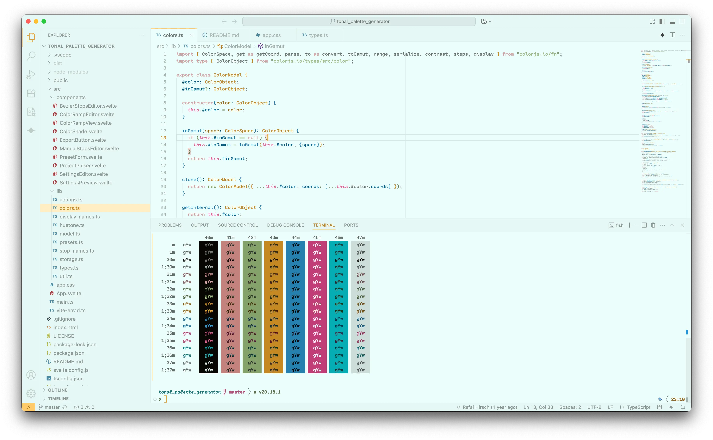
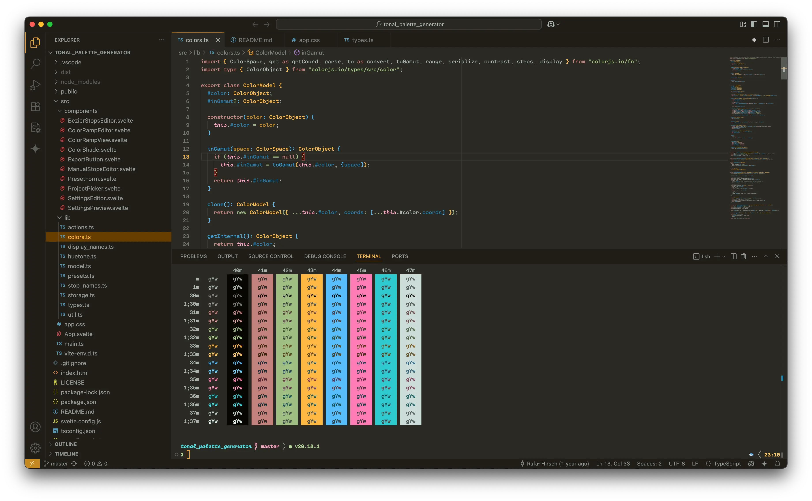

# evolved theme

My personal color theme based on the colors on https://evolved.systems.

Supports:

* [Ghostty](https://ghostty.org/)
* [iTerm2](https://iterm2.com/)
* [Sublime Text](https://www.sublimetext.com/)
* [Visual Studio Code](https://code.visualstudio.com/)
* [Zed](https://zed.dev/)

## Screenshots

Find all screenshots in the [screenshots](./screenshots) directory.

## Build

Requirements:

* [jsonnet](https://jsonnet.org/)
* Make

Run `make` to build the theme files.
