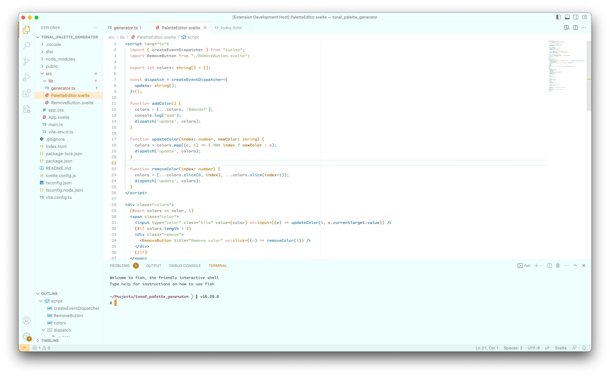
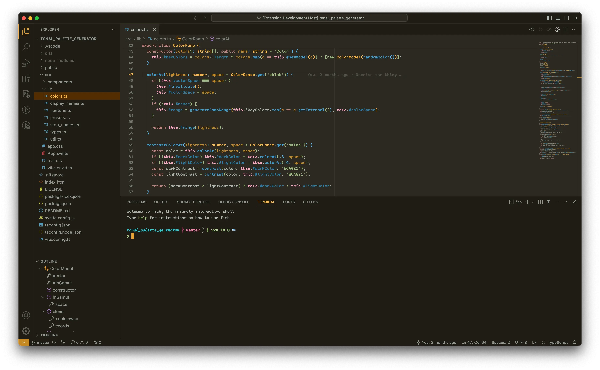

# evolved theme

My personal color theme based on the colors on https://evolved.systems.

Supports:

* Sublime Text
* Visual Studio Code
* iTerm2

## Build

Requirements:

* [jsonnet](https://jsonnet.org/)
* Make

Run `make` to build the theme files.
